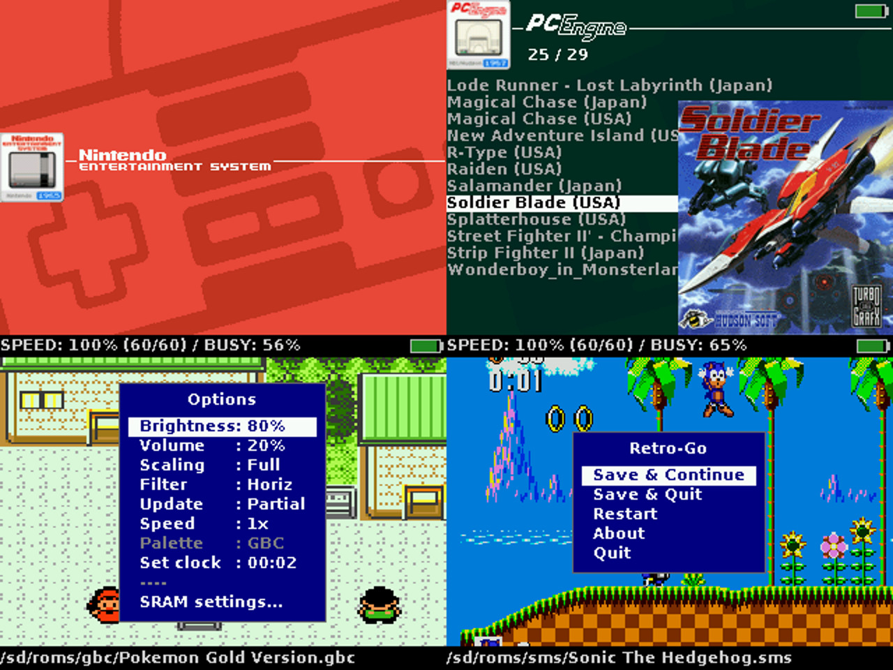

# ESP32 Emu Turbo fork: changes from upstream retro-go

This is [pjcau/retro-go](https://github.com/pjcau/retro-go), the firmware of the
[ESP32 Emu Turbo](https://github.com/pjcau/esp32-emu-turbo) handheld (ESP32-S3 N16R8,
ILI9488 480x320 8080 display, PDM audio, SD card). It forks
[ducalex/retro-go](https://github.com/ducalex/retro-go) at `4ced1206` (2026-01-16);
`git log 4ced1206..master` lists every change. The upstream README follows this section.

Docs: [firmware](https://pjcau.github.io/esp32-emu-turbo/docs/software/firmware) ·
[SNES optimization](https://pjcau.github.io/esp32-emu-turbo/docs/software/snes-optimization) ·
[boot splash](https://pjcau.github.io/esp32-emu-turbo/docs/software/boot-splash) ·
[arcade](https://pjcau.github.io/esp32-emu-turbo/docs/next-steps/arcade) ·
[forks survey](https://pjcau.github.io/esp32-emu-turbo/docs/software/retro-go-forks-survey)
(sources under [`website/docs/`](https://github.com/pjcau/esp32-emu-turbo/blob/main/website/docs)).

### Target `esp32-emu-turbo`
- **Target config** (`components/retro-go/targets/esp32-emu-turbo/`): GPIO map kept in sync with the board's `board_config.h`, IDF5 sdkconfig with USB console; RIGHT=GPIO2 / A=GPIO1 after the first article (`7c0c903d`, `d940b9a0`, `bcf19aa7`, `53878dcb`).
- **Display**: i80 parallel driver `drivers/display/st7796s_i80.h` (drives the ILI9488; name is historical), 0x3C continuation fix, landscape 480x320, rotated 180° with MADCTL 0xE8 for the tail-left enclosure (`ce2456a9`, `0e533078`, `30df124b`).
- **Audio**: new PDM TX sink `drivers/audio/pdm.c` in DAC line mode, silent when idle (`28dfc19a`, `614808d4`). **32 kHz rule**: every app runs at 32000 Hz (22050 crackled on the PDM sink), and the PDM channel is switched off while no audio arrives (`bcdabb65`, `71c4641e`).
- **Launcher**: L/R shoulder buttons switch systems (`53878dcb`).

### Console remote control (`RG_GAMEPAD_CONSOLE`, `rg_input.c`, `rg_system.c`)
- Bench control over the USB serial console: `ping`, `key`/`hold`/`release`, `launch`, `launcher`, `resume[N]`, `save`, `load`, `reboot`, `hud on|off`, `volume N` (`d1a71ee0`, `bc8fbf9c`, `1d891c8f`).
- File tools: `ls`, `put` (upload), `rm`, `mv`, `cat` (e.g. `/sd/crash.log`) (`68be4278`, `eebbcce4`).
- Bench tools: `lcd off|on`, `acap N` / `adump` (capture of the samples as submitted, to tell digital from analog artefacts) (`e3ce118a`).
- Actions run at the frame boundary (`rg_system_tick`), app switches deferred to the main task. Driven from the host by `scripts/board_ctl.py` in the main repo.

### Core library (`components/retro-go/`)
- `rg_storage.c`: FAT `max_files` 4 -> 8 (games that keep several files open, e.g. MAME zips + samples).
- `rg_audio.c`: `rg_audio_set_volume()` no longer asserts before `rg_audio_init()` (console `volume N` can arrive first); `RG_AUDIO_DEFAULT_VOLUME`; capture buffer for `acap`.
- Debug HUD for every emulator: FPS / drawn / skipped / busy / free heap, plus per-app lines (SNES_PROF, GEN_PROF), toggled from the in-game menu or the console (`f9dc0a14`).
- `rg_display_clear` syncs first (`bc8fbf9c`).

### Launcher
- "GAME BRO!" boot splash on cold boot, real-time on the board (`2a1b4fc3`, `1d891c8f`).
- Tabs added: SG-1000 (enabled), Neo Geo Pocket, Duke Nukem 3D, Wolfenstein 3D, Quake, OpenTyrian, Arcade (MAME), Neo Geo.
- Art for Arcade, Duke3D, SG-1000, Atari 2600, GBA, NGP from [rxbrad/es-theme-gbz35](https://github.com/rxbrad/es-theme-gbz35) (`801cbe9f`).

### retro-core
- **SNES (snes9x)** — the Phase 4 renderer work that brought most games to 60 fps: audio samples per frame from the ROM fps, 32 KB I-cache / 64 KB D-cache, z-buffer in internal SRAM, blank-tile cache, colour-math fast path, Mode 7 hoisting, `restrict` tile writers, backdrop colour and CGRAM 0-15 per line, save-state loader heap-corruption fix, Native 12-button keymap default, SNES_PROF counters (`8164755a` .. `c16ff62f`). See [snes-optimization.md](https://github.com/pjcau/esp32-emu-turbo/blob/main/website/docs/software/snes-optimization.md).
- **SuperFX (GSU)** brought back from snes9x2005, with the GSU running on core 1: Star Fox runs (`98f88705`).
- **SuperFX state in save states**: the GSU registers and pipeline are saved in an extra chunk, so a Star Fox save state restores the 3D exactly (`4e038331`).
- **S-DSP mixing on core 1** (Phase 5): DSP register writes queued and replayed on core 1, which mixes the frame while core 0 runs the next; same samples, one frame later (`174337d8`). The DSP-1 was profiled at ~2% of Mario Kart and left on core 0.
- **Neo Geo Pocket / Color** via the libretro RACE core (`components/race`, `main_ngp.c`) (`717df408`), later moved to retro-extra.
- SG-1000 dispatch fixed (`30df124b`); NES, GB/GBC and PC Engine draw every frame (frameskip 0) (`e733d4d3`).

### Other existing apps
- **gwenesis**: YM2612 synthesis on core 1 (register writes logged with their clock, replayed one frame later); GEN_PROF profiler (`1dbfee8a`).
- **prboom-go (DOOM)**: in-game crash fixed with a 16 KB game task stack and a PSRAM reserve for the lump cache (`66d251ed`).
- **fmsx (MSX) removed** (2026-09-29): not needed on this console; its 640 KB partition went to the GBA app (`gbsp`).
- **Lynx (handy), Atari 2600 (Stella) and Game & Watch removed** (2026-09-29); **Lynx and Atari 2600 brought back** (2026-10-03, the user): Lynx in `retro-core`, Atari 2600 in `retro-extra` with Stella's cartridge database cut to the 936 entries that change the emulation (`compact_props.py`, 540 KB to ~45 KB of flash) so it fits the 1.25 MB partition.

### New apps (partition table in `rg_tool.py`)
| App | What | Source / credit | Commits |
|-----|------|-----------------|---------|
| `retro-extra` | Neo Geo Pocket (RACE) + Atari 2600 (Stella) | [libretro RACE](https://github.com/libretro/RACE), stella-odroid-go | `8f3f0ad1` |
| `duke3d-go` | Duke Nukem 3D, ported to the current API, FatFs/menu/level fixes, 32 kHz audio | Chocolate Duke3D port by jkirsons (upstream `duke3d` branch) | `b75e5a38`, `704748f1`, `877b5d31` |
| `wolf3d-go` | Wolfenstein 3D (id source license + MAME fmopl license shipped) | [pcgamer404/retro-go-pro](https://github.com/pcgamer404/retro-go-pro) (GPL) | `fac26d34`, `5e4bc37d` |
| `quake-go` | Quake | pcgamer404/retro-go-pro (GPL) | `fac26d34` |
| `opentyrian-go` | OpenTyrian (Tyrian 2.1), native app | [DynaMight1124/retro-go](https://github.com/DynaMight1124/retro-go) | `a4b3c228` |
| `mame-go` | Arcade + Neo Geo, MAME 0.37b5 subset | [libretro mame2000](https://github.com/libretro/mame2000-libretro) (MAME non-commercial license) | see below |

### mame-go (see [arcade.md](https://github.com/pjcau/esp32-emu-turbo/blob/main/website/docs/next-steps/arcade.md))
- 8-bit boards first (`736add2b`); 68000 boards (Blood Bros., Aero Fighters) via a tile cache and read-only ROM regions memory-mapped from a 4 MB flash data partition `mamerom` added by `rg_tool.py` (`d4e9fd15`); idle-loop speed-ups for both (`570528c2`).
- Neo Geo: sprites paged from the SD card (`mamego_neospr.c`, `tools/neoprep.c`) — Sonic Wings 2 runs (`d0430d65`); 30-50 MB games with sound samples paged from SD, program in flash (`memory_rebase`), `zipstream` reads, Neo Geo tab (`643adbb2`).
- Speed: YM2610 on core 1, generic 68000/Z80 idle-loop skip, NEOPROF frame profiler (`mamego_prof.c`) (`590a63c2`); frame conversion (palette lookup + display copy) on core 1 (`88ddfac7`); scaled to fit the screen.
- Modern ROM sets: 109 Neo Geo sets from current MAME `neogeo.cpp`, generated by [`scripts/neogeo_modern_sets.py`](https://github.com/pjcau/esp32-emu-turbo/blob/main/scripts/neogeo_modern_sets.py) in the main repo (`43108b71`, `3d1734d3`).
- Exact Neo Geo save states (driver RAM, latches, YM2610 + SSG, buffer borrowed from the sprite cache); modern `<name>m` sets get the per-game fixes of `<name>` (`ec8acd7b`).
- 5 MB Neo Geo programs split between PSRAM (1 MB) and flash (4 MB banked part); clones of the modern sets (166 sets); Thrash Rally without its undumped link MCU (`22f16917`).
- Neo Geo sprite renderer on core 1 in the present task, video RAM copied by dirty 256-byte blocks (`15e1790f`).
- **Capcom CPS1** (0.37b5 driver, CPS2 left out): graphics streamed from the zip into the flash partition (+PSRAM for SF2), 69 modern sets from current MAME, partition 1.75 MB (`929fc118`, `e245fffa`).

### Partition table and build (`rg_tool.py`, target `env.py`)
- Default app list adds `duke3d-go retro-extra mame-go wolf3d-go quake-go opentyrian-go`; launcher 1.125 MB, retro-core 1.25 MB, new partitions sized per app; `mamerom` data partition (type 1, subtype 64) when mame-go is built.
- `env.py`: `IDF_TARGET = "esp32s3"`, `FW_FORMAT = "none"` (serial-flash `.img`).

---

# Table of contents
- [Description](#description)
- [Installation](#installation)
- [Usage](#usage)
- [Issues](#issues)
- [Development](#development)
- [Acknowledgements](#acknowledgements)
- [License](#license)

# Description
Retro-Go is a firmware to play retro games on ESP32-based devices (officially supported are
ODROID-GO and MRGC-G32, check [this list for other devices](components/retro-go/README.md)).
The project consists of a launcher and half a dozen applications that have been heavily
optimized to reduce their cpu, memory, and flash needs without reducing compatibility!

### Supported systems:
- Nintendo: **NES, SNES (slow), Gameboy, Gameboy Color**
- Sega: **SG-1000, Master System, Mega Drive / Genesis, Game Gear**
- Coleco: **Colecovision**
- NEC: **PC Engine**
- Atari: **Lynx, 2600**
- Others: **DOOM** (including mods!)

### Retro-Go features:
- In-game menu
- Favorites and recently played
- GB color palettes, RTC adjust and save
- NES color palettes, PAL roms, NSF support
- More emulators and applications
- Scaling and filtering options
- Better performance and compatibility
- Turbo Speed/Fast forward
- Customizable launcher
- Cover art and save state previews
- Multiple save slots per game
- Wifi file manager
- And more!

### Screenshots



# Installation

### ODROID-GO
  1. Download `retro-go_1.x_odroid-go.fw` from the [release page](https://github.com/ducalex/retro-go/releases/) and copy it to `/odroid/firmware` on your sdcard.
  2. Power up the device while holding down B.
  3. Select retro-go in the files list and flash it.

### MyRetroGameCase G32 (GBC)
  1. Download `retro-go_1.x_mrgc-g32.fw` from the [release page](https://github.com/ducalex/retro-go/releases/) and copy it to `/espgbc/firmware` on your sdcard.
  2. Power up the device while holding down MENU (the volume knob).
  3. Select retro-go in the files list and flash it.

### Other devices
  1. Download the .img for your device from the [release page](https://github.com/ducalex/retro-go/releases/).
  2. Connect your device to a computer with a USB cable.
  3. Flash the image with esptool:
     - [Command line](https://github.com/espressif/esptool/releases/): Run `esptool.py write_flash --flash_size detect 0x0 retro-go_*.img`
     - [Web version](https://espressif.github.io/esptool-js/): Connect your device, click Erase Flash, then select your .img file and set address to 0x0, finally click Program)

Your particular device may require extra steps (like holding a button during power up) or different esptool flags or a special cable. If the above steps fail, you might need to ask the manufacturer for instructions on how to flash new firmware!

If your device is not already supported or if a prebuilt version isn't available for it you can check the [development section](#Development) for more information on how to build for your device.


# Usage

## Game covers / artwork
Game covers should be placed in the `romart` folder at the base of your sd card. You can obtain a pre-made pack [here](https://github.com/ducalex/retro-go-covers). Retro-Go is also compatible with the older Go-Play romart pack.

You can add missing cover art by creating a PNG image (160x168, 8bit). Two naming schemes are supported:
- Filename-based: `/romart/nes/Super Mario.png` (notice the rom extension is *not* included)
- CRC32-based: `/romart/nes/A/ABCDE123.png` where `nes` is the same as the rom folder, and `ABCDE123` is the CRC32 of the game (press A -> Properties in the launcher to find it), and `A` is the first character of the CRC32

_Note: CRC32-based, which is what is used in the pre-made pack, is much slower than name-based! This type is useful because filenames vary greatly despite having identical CRCs, but if you generate your own art I suggest you use filename-based format and delete all CRC-based art from your SD Card to improve responsiveness._


## BIOS files
Some emulators support loading a BIOS. The files should be placed as follows:
- GB: `/retro-go/bios/gb_bios.bin`
- GBC: `/retro-go/bios/gbc_bios.bin`
- FDS: `/retro-go/bios/fds_bios.bin`


## Wifi
To use wifi you will need to create a `/retro-go/config/wifi.json` config file. You can define up to 4 different networks, then selectable in the menu. Its content should look like this:

````json
{
  "ssid0": "my-network",
  "password0": "my-password",
  "ssid1": "my-other-network",
  "password1": "my-password",
  "ssid2": "my-third-network",
  "password2": "my-password",
  "ssid3": "my-last-network",
  "password3": "my-password"
}
````

### Time synchronization
Time synchronization happens in the launcher immediately after a successful connection to the network.
This is done via NTP by contacting `pool.ntp.org` and cannot be disabled at this time.
Timezone can be configured in the launcher's options menu.

### File manager
You can find the IP of your device in the *about* menu of retro-go. Then on your PC navigate to
http://192.168.x.x/ to access the file manager.


## External DAC (headphones)

Retro-Go supports [the external DAC mod for the ODROID-GO](https://github.com/backofficeshow/odroid-go-audio-hat)
which allows high quality audio through headphones. You can switch to it in the menu `Audio Out: Ext DAC`.

<details>
  <summary>Pinout</summary>

  | GO PIN | PCM5102A PIN |
  |--------|---------|
  | 1 | GND |
  | 2 | - |
  | 3 | LCK |
  | 4 | DIN |
  | 5 | BCK |
  | 6 | VIN |
  | 7 | - |
  | 8 | - |
  | 9 | - |
  | 10 | - |
</details>


# Issues

### Black screen / Boot loops
Retro-Go typically detects and resolves application crashes and freezes automatically. However, if you do
get stuck in a boot loop, you can hold `DOWN` while powering up the device to return to the launcher.

### Sound quality
The volume isn't correctly attenuated on the GO, resulting in upper volume levels that are too loud and
lower levels that are distorted due to DAC resolution. A quick way to improve the audio is to cut one
of the speaker wire and add a `33 Ohm (or thereabout)` resistor in series. Soldering is better but not
required, twisting the wires tightly will work just fine.
[A more involved solution can be seen here.](https://wiki.odroid.com/odroid_go/silent_volume)
Alternatively you can use the headphones DAC mod mentioned earlier in this document.

### Game Boy SRAM *(aka Save/Battery/Backup RAM)*
In Retro-Go, save states will provide you with the best and most reliable save experience. That being said, please
read on if you need or want SRAM saves. The SRAM format is compatible with VisualBoyAdvance so it may be used to
import or export saves.

You can configure automatic SRAM saving in the options menu. A longer delay will reduce stuttering at the cost
of losing data when powering down too quickly. Also note that when *resuming* a game, Retro-Go will give priority
to a save state if present.

### ZIP files
Most Retro-Go applications now support ZIP files. ZIP archives should contain only one ROM file and nothing else. ZIP support also depends on available memory and larger ROMs may fail to load on some devices unfortunately.


# Development
If you wish to build or modify Retro-Go, you can find help in the following documents:

- Build instructions in [BUILDING.md](BUILDING.md)
- Theming instructions [THEMING.md](THEMING.md)
- Porting instructions in [PORTING.md](PORTING.md)
- Translating instructions in [LOCALIZATION.md](LOCALIZATION.md)


# Acknowledgements
- The NES/GBC/SMS emulators and base library were originally from the "Triforce" fork of the [official Go-Play firmware](https://github.com/othercrashoverride/go-play) by crashoverride, Nemo1984, and many others.
- The design of the launcher was originally inspired/copied from [pelle7's go-emu](https://github.com/pelle7/odroid-go-emu-launcher).
- PCE-GO is a fork of [HuExpress](https://github.com/kallisti5/huexpress) and [pelle7's port](https://github.com/pelle7/odroid-go-pcengine-huexpress/) was used as reference.
- The SNES emulator is a port of [Snes9x 2005](https://github.com/libretro/snes9x2005).
- The DOOM engine is a port of [PrBoom 2.5.0](http://prboom.sourceforge.net/).
- The Genesis emulator is a port of [Gwenesis](https://github.com/bzhxx/gwenesis/) by bzhxx.
- The MSX emulator is a port of [fMSX](https://fms.komkon.org/fMSX/) by Marat Fayzullin.
- The Atari 7800 emulator is [ProSystem](https://github.com/libretro/prosystem-libretro) by Greg Stanton (libretro core).
- The Atari 5200 and Commodore 64 emulators come from [MCUME](https://github.com/Jean-MarcHarvengt/MCUME) by Jean-Marc Harvengt: the Atari800 core and Frank Bösing's Teensy64, with Dag Lem's reSID.
- PNG support is provided by [lodepng](https://github.com/lvandeve/lodepng/).
- PCE cover art is from [Christian_Haitian](https://github.com/christianhaitian).
- Some icons from [Rokey](https://iconarchive.com/show/seed-icons-by-rokey.html).
- Background images from [es-theme-gbz35](https://github.com/rxbrad/es-theme-gbz35); logos, banners and backgrounds of the systems added by this fork (Arcade, Duke Nukem 3D, SG-1000, Atari 2600, GBA, NGP) too, via `tools/import_gbz35_art.py`.
- Special thanks to [RGHandhelds](https://www.rghandhelds.com/) and [MyRetroGamecase](https://www.myretrogamecase.com/) for sending me a [G32](https://www.myretrogamecase.com/products/game-mini-g32-esp32-retro-gaming-console-1) device.
- The [ODROID-GO](https://forum.odroid.com/viewtopic.php?f=159&t=37599) community for encouraging the development of retro-go!

# License
Everything in this project is licensed under the [GPLv2 license](COPYING) with the exception of the following components:
- retro-core/components/handy (Lynx emulator, zlib)
- fmsx/components/fmsx (MSX Emulator, custom non-commercial license)
- retro-home/components/c64 (Commodore 64: Teensy64, GPLv3 or later; reSID, GPLv2 or later): with it the retro-home app is GPLv3 or later, see its LICENSE.md
- retro-home/components/atari5200 (Atari 5200: the Atari800 core via MCUME, GPLv2 or later)
